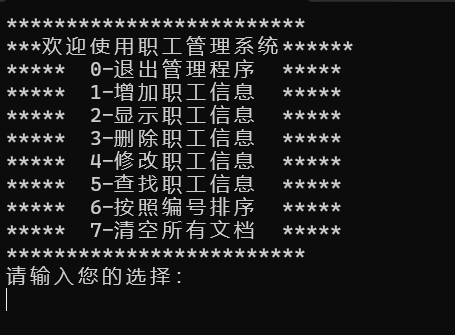
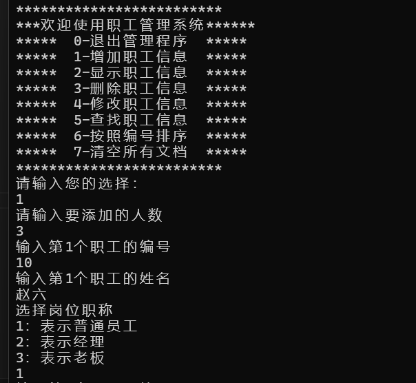

+++
alwaysopen = false
type = "contents"
title = '基于C++的职工管理系统'
categories = ["C++项目"]
tags = ["C++", "基础项目"]
description = '描述文章内容'
[params]
  LastModifierDisplayName = '@王四季（maloudowm）'
  LastModifierEmail = '1642626049@qq.com'
  date = 2025-04-27T21:35:00+08:00
+++

## 项目需求


## 项目功能


## 效果图

### 界面



### 增加



### 显示


……

## 开始项目开发

### 1.创建管理类

#### 管理类功能

管理类负责内容


#### 实现代码

添加头文件：

```cpp
#pragma once //防止头文件重复包含
#include <iostream>

using namespace std;

class WorkerManager
{
public:
	WorkerManager();
	~WorkerManager();
};
```

添加源文件：

```cpp
#include "WorkerManager.h"

WorkerManager::WorkerManager()
{
}

WorkerManager::~WorkerManager()
{
}
```

### 2.添加菜单功能

#### 添加菜单显示函数

```h
class WorkerManager
{
public:
	WorkerManager();
  void Show_Menu();
	~WorkerManager();
};
```

#### 显示菜单界面

```h
void WorkerManager::Show_Menu()
{
	cout << "*************************" << endl;
  cout << "***欢迎使用职工管理系统******" << endl;
  cout << "*****  0-退出管理程序  *****" << endl;
	cout << "*****  1-增加职工信息  *****" << endl;
	cout << "*****  2-显示职工信息  *****" << endl;
	cout << "*****  3-删除职工信息  *****" << endl;
	cout << "*****  4-修改职工信息  *****" << endl;
	cout << "*****  5-查找职工信息  *****" << endl;
	cout << "*****  6-按照编号排序  *****" << endl;
  cout << "*****  7-清空所有文档  *****" << endl;
	cout << "*************************" << endl;
}
```

#### 测试菜单界面

```cpp
#include <iostream>
using namespace std;
#include "workerManager.h"

int main()
{
	WorkerManager wm;
	wm.Show_Menu();
	system("pause");
	return 0;
}
```

### 3.退出功能

#### 添加退出功能

```cpp
class WorkerManager
{
public:
	WorkerManager();
  void Show_Menu();
  void ExitSystem();
	~WorkerManager();
};
```

#### 实现退出功能

```cpp
void WorkerManager::ExitSystem()
{
	cout << "欢迎下次使用" << endl;
	system("pause");
	exit(0);
}
```

#### 测试退出功能

```cpp
int main()
{
	WorkerManager wm;
	int choice = 0;
	while (true)
	{
		wm.Show_Menu(); //显示菜单
		cout << "请输入您的选择： " << endl;
		cin >> choice;
		switch (choice)
		{
		case 0: //退出系统
			wm.ExitSystem();
			break;
		case 1: //增加职工
			break;
		case 2: //显示职工
			break;
		case 3: //删除职工
			break;
		case 4: //修改职工
			break;
		case 5: //查找职工
			break;
		case 6: //按照编号排序
			break;
		case 7: //清空文件
			break;
		default:
			cout << "输入有误，请重新输入" << endl;
			system("pause");
			system("cls"); //清屏操作
			break;
		}
	}
	system("pause");
	return 0;
}
```

### 4.编写职工类

将三个职工抽象为一个类，利用多态管理不同职工；
职工属性行为：
职工行为：

#### 写worker.h头文件

```h
#pragma once
#include <iostream>
using namespace std;
#include <string>
//职工抽象类
class Worker
{
public:
	//显示个人性息
	virtual void showInfo() = 0;
	//获取岗位个人性息
	virtual string GetDeptName() = 0;
	//职工编号
	int m_Id;
	//职工姓名
	string m_Name;
	//部门编号
	int m_DeptId;

};
```

#### 写employee.h、manager.h、boss.h头文件

```h
#pragma once
#include <iostream>
using namespace std;
#include <string>
#include "worker.h"
//职工类
class Employee:public Worker
{。
public:
	Employee(int id,string name,int did);
	//显示个人性息
	void showInfo();
	//获取岗位个人性息
	string GetDeptName();
};
```

#### 写employee.cpp等源文件

```cpp
#include "employee.h"//不同岗位此处不同

Employee::Employee(int id, string name, int did)
{
	this->m_Id = id;
	this->m_Name = name;
	this->m_DeptId = did;
}
//显示个人性息
void Employee::showInfo()
{
	cout << "职工编号：" << this->m_Id
		<< "\t职工姓名：" << this->m_Name
		<< "\t岗位：" << this->GetDeptName()
		<< "\t岗位职责：完成经理交给的任务" << endl;

}
//获取岗位个人性息
string Employee::GetDeptName()
{
	return string("员工");//不同岗位此处不同
}
```

#### 在主函数中测试

```cpp
Worker* worker = new Employee(20, "张三", 3);
worker->showInfo();
delete worker;

worker = new Manager(10, "李四", 2);
worker->showInfo();
delete worker;

worker = new Boss(1, "王五", 1);
worker->showInfo();
delete worker;
```

### 5.添加职工

#### 添加成员函数

```cpp
class WorkerManager
{
public:
	//构造函数
	WorkerManager();
	//展示菜单
	void Show_Menu();
	//退出系统
	void ExitSystem();

	//添加职工函数
	void Add_Emp();

	//记录数组中有多少个职工人数
	int m_EmpNum;

	//职工数组指针，使用双重指针管理worker数组指针，数组类型是*Worker
	Worker** m_EmpArray;
	~WorkerManager();
};
```

#### 实现添加职工

```cpp
void WorkerManager::Add_Emp()
{
	//提示
	cout << "请输入要添加的人数" << endl;

	//保存输入的人数
	int addNum = 0;
	cin >> addNum;
	if (addNum > 0)
	{
		//添加
		//计算添加空间大小
		int newSize = this->m_EmpNum + addNum;

		//开辟空间,使用二级指针指向一个指针数组，这个指针数组会因为多态而指向不同职工
		Worker **newSpace = new Worker *[newSize];

		//如果原来有数据要复制到新空间下
		if (this->m_EmpArray != NULL)
		{
			for (int i = 0; i < this->m_EmpNum; i++)
			{
				newSpace[i] = this->m_EmpArray[i];
			}
		}

		//添加新成员
		for (int i = 0; i < addNum; i++)
		{
			int id;
			string name;
			int dSelect;

			cout << "输入第"<<i+1<<"个职工的编号" << endl;
			cin >> id;

			cout << "输入第" << i + 1 << "个职工的姓名" << endl;
			cin >> name;

			cout << "选择岗位职称" << endl;
			cout << "1：表示普通员工" << endl;
			cout << "2：表示经理" << endl;
			cout << "3：表示老板" << endl;
			cin >> dSelect;

			Worker* worker = NULL;
			switch (dSelect)
			{
			case 1:
				worker = new Employee(id, name, 1);
				break;
			case 2:
				worker = new Manager(id, name, 2);
				break;
			case 3:
				worker = new Boss(id, name, 3);
				break;
			default:
				break;
			}

			//将职工信息添加到数组中
			newSpace[this->m_EmpNum + i] = worker;
		}

		//释放堆区数据
		delete[] m_EmpArray;

		//更新双重指针的指向
		this->m_EmpArray = newSpace;

		//更新人数
		this->m_EmpNum = newSize;

		//文件不为空
		this——>m_FileIsEmpty = false;

		//成功添加后保存到文件中
		Save();

		//提示添加成功
		cout << "添加成功，添加了"<<addNum<<"人" << endl;
		system("pause");
		system("cls");
	}
	else
	{
		cout << "输入错误" << endl;
	}

}
```

#### 测试添加职工

```cpp
int main()
{
	WorkerManager wm;
	int choice = 0;//用于存储用户选择
	
	while (true)
	{
		wm.Show_Menu(); //显示菜单
		cout << "请输入您的选择： " << endl;
		cin >> choice;
		switch (choice)
		{
		case 0: //退出系统
			wm.ExitSystem();
			break;
		case 1: //增加职工
			wm.Add_Emp();
			break;
		case 2: //显示职工
			break;
		case 3: //删除职工
			break;
		case 4: //修改职工
			break;
		case 5: //查找职工
			break;
		case 6: //按照编号排序
			break;
		case 7: //清空文件
			break;
		default:
			cout << "输入有误，请重新输入" << endl;
			system("pause");
			system("cls"); //清屏操作
			break;
		}
	}
	system("pause");
	return 0;
}
```

### 6.职工数据保存

因程序运行结束后添加的数据会被清除，再次打开创建的数据就没有了，所以需要将数据保存到文件中，下次打开时可以读取文件中的数据。

#### 创建保存数据函数

在WorkerManager.h中添加保存数据函数Save()；并在WorkerManager.cpp中实现，实现代码如下：

```cpp
void WorkerManager::Save()
{
	//创建写入文件对象
	ofstream ofs;
	//打开文件
	ofs.open(FILENAME, ios::out);
	//开始写入
	for (int i = 0; i < this->m_EmpNum; i++)
	{
		ofs << this->m_EmpArray[i]->m_Id << " "
			<< this->m_EmpArray[i]->m_Name << " "
			<< this->m_EmpArray[i]->m_DeptId << endl;
	}
	//关闭文件
	ofs.close();
}
```
接着在WorkerManager.cpp中Add_Emp()函数中添加保存数据函数，详细查看[代码](#实现添加职工)。

#### 读取文件中的数据

在读取文件的过程中，文件可能有一下三种情况：

- 文件不存在
- 文件存在，但是文件中无数据
- 文件存在，并且文件中有已写入的数据

#### 文件为空的情况

在worrkerManager.h中添加一个bool类型的m_FileIsEmpty成员变量用于记录文件是否为空。

在WorkerManager.cpp中构造函数中添加代码，当文件为空时如何操作：

```cpp
WorkerManager::WorkerManager()
{
	//1，判断文件是否存在
	ifstream ifs;
	ifs.open(FILENAME, ios::in);
	if (!ifs.is_open())
	{
		cout << "文件不存在" << endl;
		//初始化属性
		this->m_EmpArray = NULL;
		this->m_EmpNum = 0;
		this->m_FileIsEmpty = true;

		ifs.close();
		return;
	}
	//文件存在，但是没有记录
	char ch;
	ifs >> ch;
	if (ifs.eof())
	{
		//文件为空
		cout << "文件为空" << endl;
		//初始化属性
		this->m_EmpArray = NULL;
		this->m_EmpNum = 0;
		this->m_FileIsEmpty = true;

		ifs.close();
		return;
	}
}
```

因为每次添加人数后文件就不是空的，所以需要在函数Add_Emp()中添加代码，当文件不为空时，将m_FileIsEmpty = false，详细查看[代码](#实现添加职工)。

#### 文件不为空的情况

在为文件中WorkerManager.h类添加如下成员函数：

```cpp
//统计文件中的人数
int Get_EmpNUm();

//如果文件存在且有记录，读出数据并存储在数组中，初始化员工人数
void initEmp();
```

在WorkerManager.cpp中实现Get_EmpNUm()、initEmp()函数，实现代码如下：

```cpp
int WorkerManager::Get_EmpNUm()//用于记录人数个数
{
	ifstream ifs;
	ifs.open(FILENAME, ios::in);

	int id;
	string name;
	int did;

	int empNum = 0;

	while (ifs >> id && ifs >> name && ifs >> did)
	{
		empNum++;
	}
	return empNum;
}
void WorkerManager::initEmp()
{
	//打开文件
	ifstream ifs;
	ifs.open(FILENAME, ios::in);

	int id;
	string name;
	int dId;

	int index = 0;

	while (ifs >> id && ifs >> name && ifs >> dId)
	{
		Worker* worker = NULL;
		if (dId == 1)
		{
			worker = new Employee(id, name, dId);
		}
		else if (dId == 2)
		{
			worker = new Manager(id, name, dId);
		}
		else
		{
			worker = new Boss(id, name, dId);
		}
		this->m_EmpArray[index] = worker;//将数据存储在指针数组中
		index++;//记录人数
	}
	//关闭文件
	ifs.clear();
}
```

此时回到构造函数中添加如下代码

```cpp
//文件存在,并有记录
int num = this->Get_EmpNUm();
cout << "职工人数为：" << num<<endl;
this->m_EmpNum = num;
//开辟空间
this->m_EmpArray = new Worker * [this->m_EmpNum];
//将数据存到数组中
this->initEmp();

//测试代码，可以删除
for (int i = 0; i < this->m_EmpNum; i++)
{
	cout << "职工编号" << this->m_EmpArray[i]->m_Id << " "
		<< "职工姓名：" << this->m_EmpArray[i]->m_Name << " "
		<< "职工职称：" << this->m_EmpArray[i]->GetDeptName() << endl;

}


```

### 7.显示职工

在WorkerManager.h中添加如下成员函数：

```cpp
//显示职工
void Show_Emp();
```

在WorkerManager.cpp中实现Show_Emp()函数，实现代码如下：

```cpp
//判断文件是否为空
if (this->m_FileIsEmpty)
{
	cout << "文件不存在或为空" << endl;

}
else
{
	for (int i = 0; i < this->m_EmpNum; i++)
	{
		this->m_EmpArray[i]->showInfo();
	}
	system("pause");
	system("cls");
}
```

#### 测试显示职工

在main()函数中添加如下代码：

```cpp
case 2: //显示职工
	wm.Show_Emp();
	break;
```

### 8.删除职工

#### 实现思路

- 先判断文件是否存在
- 如果文件不存在，则提示文件不存在，删除失败。
- 如果文件存在，则提示用户输入要删除的职工编号
- 在文件中查找该编号的职工，如果找到了，则进行删除，如果没找到，则提示用户输入的职工编号错误

#### 实现删除职工

在WorkerManager.h中添加如下成员函数：

```cpp
// 删除职工
void Del_Emp();
//判断职工是否存在
int IsExist(int id);
```

在WorkerManager.cpp中实现Del_Emp()函数，实现代码如下：

```cpp
// 删除职工
void WorkerManager::Del_Emp()
{
	if (this->m_FileIsEmpty)
	{
		cout << "文件不存在" << endl;
	}
	else
	{
		cout << "请输入要删除的职工编号" << endl;
		int id = 0;
		cin >> id;

		int index = this->IsExist(id);

		if (index != -1 ) {
			for (int i = index; i < this->m_EmpNum - 1; i++)
			{
				//数据前移
				this->m_EmpArray[i] = this->m_EmpArray[i + 1];
			}
			//更新人数
			this->m_EmpNum--;

			//同步到文件中
			this->Save();

			cout << "删除成功" << endl;
			system("pause");
			system("cls");
		}
		else
		{
			cout << "职工编号不存在" << endl;
			system("pause");
			system("cls");
		}
	}
}
//判断职工是否存在
int WorkerManager::IsExist(int id)
{
	int index = -1;
	for (int i = 0; i < this->m_EmpNum; i++)
	{
		if (this->m_EmpArray[i]->m_Id == id)
		{
			//按照编号，找到职工
			index = i;
			break;
		}
	}
	return index;
}
```

### 9.修改职工

#### 实现思路

- 先判断文件是否存在
- 如果文件不存在，则提示文件不存在，修改失败。
- 如果文件存在，则提示用户输入要修改的职工编号
- 在文件中查找该编号的职工，如果找到了，则提示用户输入新的职工信息，并且更新到文件中

#### 实现修改职工

在WorkerManager.h中添加如下成员函数：

```cpp
//修改职工
void Mod_Emp();
```

在WorkerManager.cpp中实现Mod_Emp()函数，实现代码如下：

```cpp
//修改职工
void WorkerManager::Mod_Emp()
{
	if (this->m_FileIsEmpty)
	{
		cout << "文件不存在" << endl;
	}
	else
	{
		cout << "请输入要修改的员工编号" << endl;
		int oldId = 0;
		cin >> oldId;

		int ret = this->IsExist(oldId);
		if (ret != -1)
		{
			//先清空原有数据
			delete  this->m_EmpArray[ret];

			//提示输入，修改职工信息
			int id;
			string name;
			int dSelect;

			cout << "查到：" << oldId << "号职工，请输入职工新编号" << endl;
			cin >> id;

			cout << "输入职工的姓名" << endl;
			cin >> name;

			cout << "选择岗位职称" << endl;
			cout << "1：表示普通员工" << endl;
			cout << "2：表示经理" << endl;
			cout << "3：表示老板" << endl;
			cin >> dSelect;

			Worker* worker = NULL;
			switch (dSelect)
			{
			case 1:
				worker = new Employee(id, name, 1);
				break;
			case 2:
				worker = new Manager(id, name, 2);
				break;
			case 3:
				worker = new Boss(id, name, 3);
				break;
			default:
				break;
			}

			//将职工信息添加到数组中
			this->m_EmpArray[ret] = worker;
			cout << "修改成功" << endl;
			//同步到文件
			this->Save();
		}
		else
		{
			cout << "修改失败，员工编号不存在" << endl;
		}
	}
	system("pause");
	system("cls");
}
```

### 10.查找职工

详细请查看代码：

```cpp
int WorkerManager::IsNameExist(string name) {
	bool flag = -1;
	for (int i = 0; i < this->m_EmpNum; i++)
	{
		if (this->m_EmpArray[i]->m_Name == name)
		{
			flag = i;
			break;
		}
	}
	return flag;
}
void WorkerManager::Find_Emp()
{
	if (this->m_FileIsEmpty)
	{
		cout << "文件不存在" << endl;
	}
	else
	{
		cout << "请输入查找方式" << endl;
		cout << "1：按照编号查询" << endl;
		cout << "2：按照姓名查询" << endl;
		int select = 0;
		cin >> select;

		switch (select)
		{
		case 1:
		{
			//按照编号查询
			int id;
			cout << "请输入查找的编号：" << endl;
			cin >> id;
			int index = 0;
			index = this->IsExist(id);

			if(index != -1)
			{
				cout << "查询到编号为"<<id<<"的职工，信息如下：" << endl;
				this->m_EmpArray[index]->showInfo();
			}
			else
			{
				cout << "查无此人！" << endl;
			}
		}
			break;
		case 2:
		{
			//按照姓名查找
			string name;
			cout << "请输出要查找的职工姓名：" << endl;
			cin >> name;

			int index = this->IsNameExist(name);
			if (index != -1)
			{
				cout << "查找成功," << name << "职工的信息如下:" << endl;
				this->m_EmpArray[index]->showInfo();
			}
			else
			{
				cout << "查无此人" << endl;
			}
		}
			break;
		default:
			cout << "输入错误请重新输入！！" << endl;
			break;
		}
	}
	this->Cls_coutContents();
}
```

### 11.按照编号排序

详细查看代码：

```cpp
void WorkerManager::Sort_Emp()
{
	if (this->m_FileIsEmpty)
	{
		cout << "文件不存在或为空" << endl;
		this->Cls_coutContents();
	}
	else
	{
		//文件存在输入编号，设置升序，降序
		cout << "输入数字设置排序" << endl;
		cout << "1:升序" << endl;
		cout << "2:降序" << endl;

		int select = 0;
		cin >> select;
		for (int i = 0; i < this->m_EmpNum; i++)
		{
			//假设i下标对象中的编号就是最大的
			int minOrMan = i;
			for (int j = 0; j < this->m_EmpNum; j++)
			{
				if (select == 1)//升序
				{
					if (this->m_EmpArray[minOrMan]->m_Id > this->m_EmpArray[j]->m_Id)//如果是大于，把下标赋值给minOrman
					{
						minOrMan = j;
					}
				}
				else 
				{
					if (this->m_EmpArray[minOrMan]->m_Id < this->m_EmpArray[j]->m_Id)//如果是小于，把下标赋值给minOrman
					{
						minOrMan = j;
					}
				}
			}

			//以升序为例，当假设的值最大值minOrMan与j中对象比较完后，
			// 就能得到第一轮真正最大的下标，这个是时候交换数据即可
			if (minOrMan != i)
			{
				Worker* temp = this->m_EmpArray[i];
				this->m_EmpArray[i] = this->m_EmpArray[minOrMan];
				this->m_EmpArray[minOrMan] = temp;
			}
		}
		cout << "排序成功" << endl;
		//同步数据到文件
		this->Save();
		this->Show_Emp();
	}
}
```

### 12.清空文件

详细查看代码：

```cpp
void WorkerManager::Clean_File()
{
	cout << "确定清空文件" << endl;
	cout << "1:确定" << endl;
	cout << "2:取消" << endl;

	int select = 0;
	cin >> select;

	if(select == 1)
	{
		//清空文件
		ofstream ofs(FILENAME,ios::trunc);
		ofs.close();

		//判断存储指针对象的数组是否为空，为空则需要一一清楚堆区的每个职工
		if (this->m_EmpArray != NULL)
		{
			for (int i = 0; i < this->m_EmpNum; i++)
			{
				delete this->m_EmpArray[i];
				this->m_EmpArray[i] = NULL;//避免野指针
			}

			//释放指针数组
			delete[] this->m_EmpArray;
			this->m_EmpArray = NULL;
			this->m_EmpNum = 0;
			this->m_FileIsEmpty = true;

			cout << "文件清除成功。" << endl;
		}
	}
	this->Cls_coutContents();
}
void WorkerManager::Cls_coutContents() 
{
	system("pause");
	system("cls");
}
```

## 结束语

以上就是一个基于C++的职工管理系统，希望对大家有所帮助。